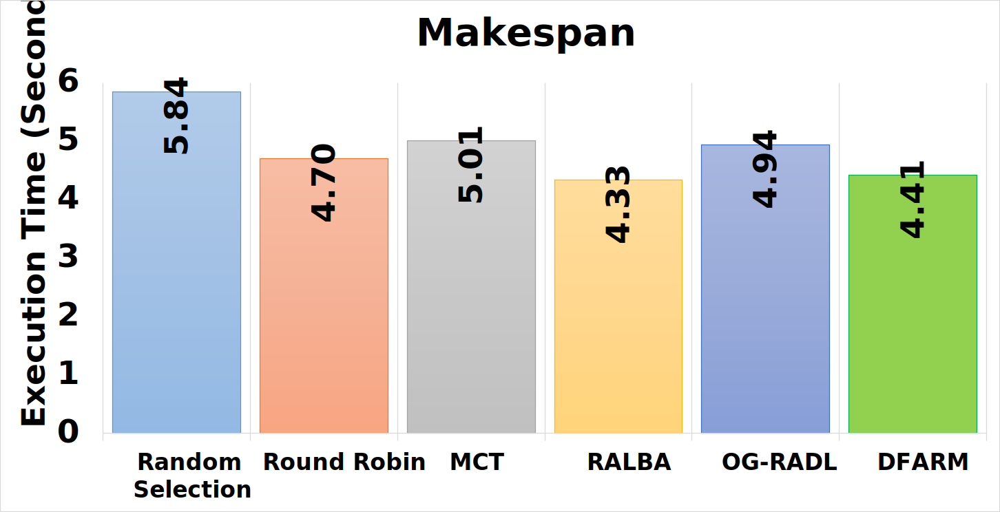
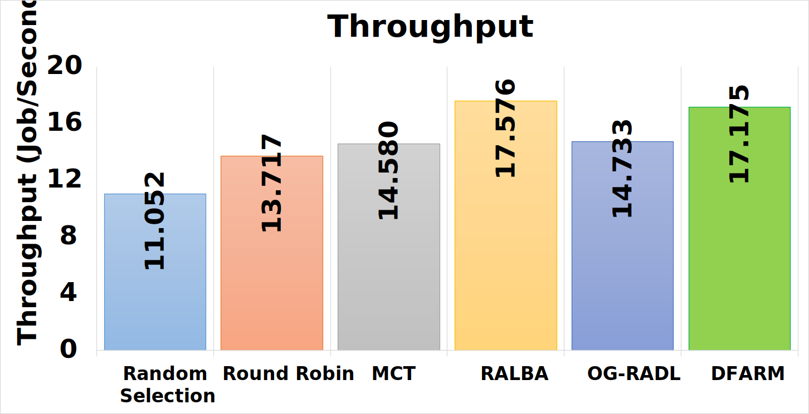
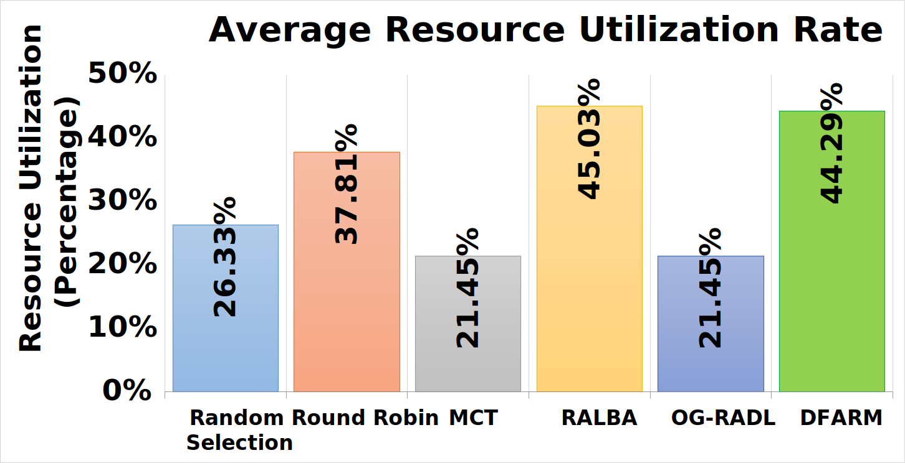
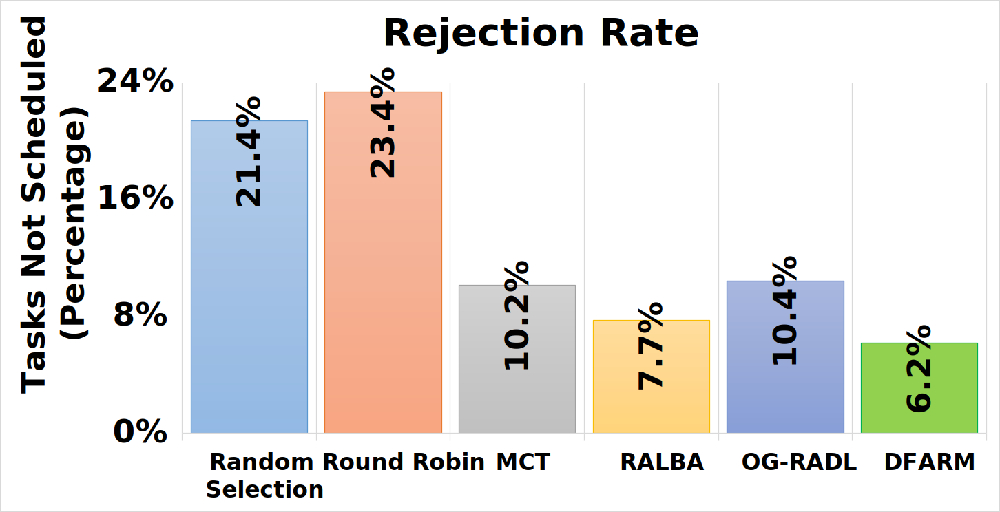
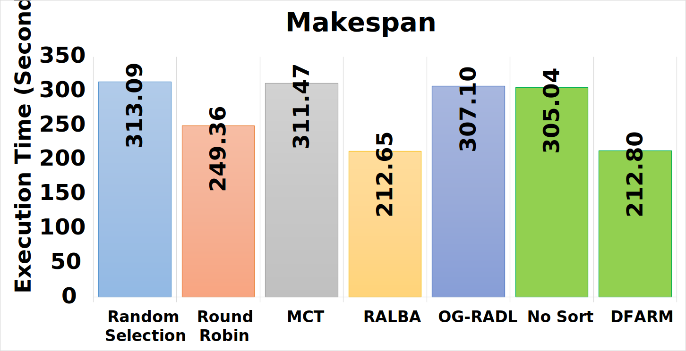
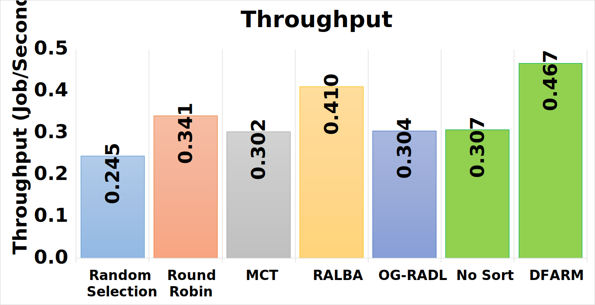
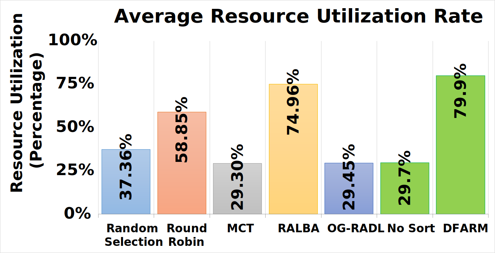
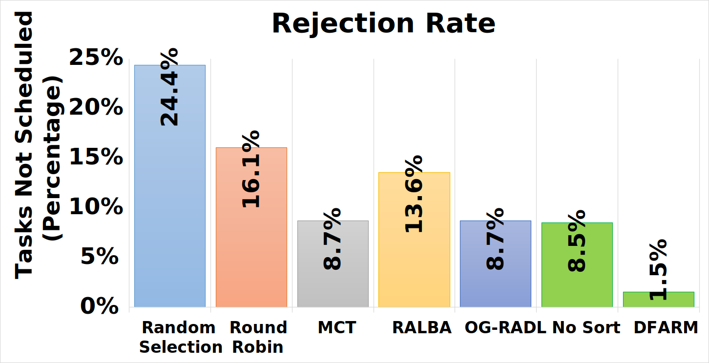

The source code for the scheduler DFARM along with Ralba and others. This was coded using the Eclipse IDE and the main scheduler class in located in modules/cloudsim-examples/src/main/java/org/cloudbus/cloudsim/examples/MyScheduler. The other schedulers are located alongside MyScheduler in RALBA. Both files have controls at the top, they are used to select scheduler and other properties.

# Results

Following are the results for the DFARM scheduler campared to other schedulers.

## Synthetic

Following is the results of a simulation for synthetic dataset.

## Google

Following is the results of a simulation for Google-like dataset.

